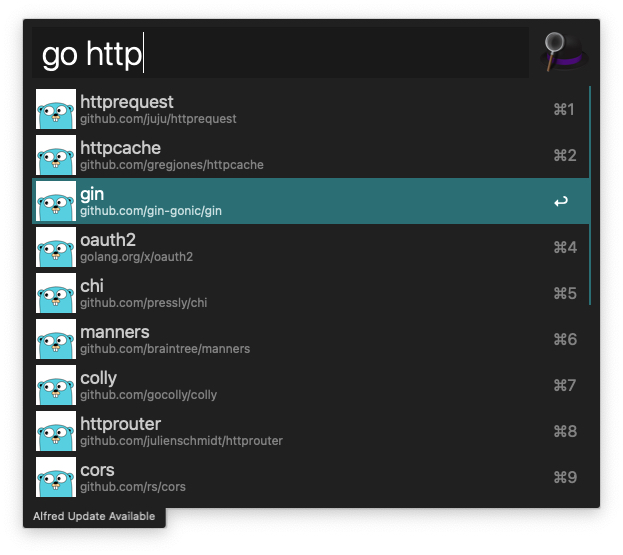

# alfred-go-pacakge-search
The Alfred workflow plugin for golang package search.

# Quick Start

First, download and install this [workflow](https://github.com/scottzhlin/alfred-go-pacakge-search/blob/main/gomodsearch.alfredworkflow) into alfred.

Using the alfred shortcut key you set to start alfred search box, and then enter the keyword ```go``` and the go package
which you want to find. Wait a while, you just can see that the package with a higher relevant score is searched, and 
then you can enter the corresponding package transferred to the corresponding page.



# Thanks

* https://github.com/golang/gddo/wiki/API
* https://github.com/deanishe/awgo